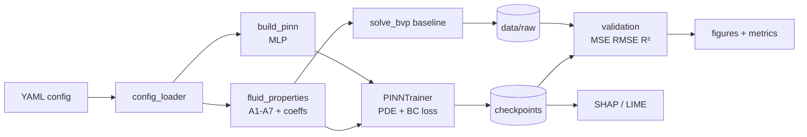

# Architecture

## Design principles

1. **Config-driven, no hardcoding.** Fluid parameters, term switches, layer
   sizes, epochs, loss weights — everything flows from YAML
   (`src/core/config_loader.py` is the single entry point; `configs/schema.json`
   validates it on load).
2. **One physics contract, two solvers.** `governing_equations.py` (PINN) and
   `numerical_rk45.py` (BVP) implement the *same* term switches, so validation
   compares like with like. See [Equation catalog](equations.md).
3. **Coefficients computed once.** `fluid_properties.py` converts base-fluid +
   particle data and `physics:` scalars into one flat coefficient dict
   consumed by both solvers.
4. **Graceful optionality.** SHAP/LIME degrade to analytic fallbacks when the
   packages are absent; CUDA falls back to CPU.

## Module map

| Module | Responsibility | Key entry points |
|---|---|---|
| `core/config_loader` | Load + schema-validate YAML, resolve device | `load_config`, `validate_config`, `resolve_device` |
| `core/fluid_properties` | Brinkman/Maxwell stepwise mixtures, A1–A7 | `TrihybridProperties`, `compute_coefficients` |
| `models/pinn_architecture` | Config-driven MLP η → (f, θf, θs, φ) | `build_pinn`, `PINN` |
| `physics/governing_equations` | Term-switched PDE residuals (autograd ≤ 3rd order) | `compute_derivatives`, `pde_residuals` |
| `physics/boundary_conditions` | Inner/outer wall residuals | `bc_residual` |
| `solvers/pinn_trainer` | Weighted loss loop, Adam/LBFGS, checkpoints | `PINNTrainer.train`, `predict`, `save/load` |
| `solvers/numerical_rk45` | `solve_bvp` baseline on the same equations | `solve_bvp_baseline`, `save_baseline` |
| `analysis/validation` | MSE/RMSE/R², quality gate | `evaluate_predictions`, `meets_accuracy_gate` |
| `analysis/shap_explainer` | Global attributions | `spatial_shap`, `parameter_sensitivity_sweep` |
| `analysis/lime_explainer` | Local surrogate explanations | `spatial_lime`, `parameter_lime` |
| `analysis/visualization` | Loss, profiles, parity figures | `plot_all`, `plot_loss`, `plot_profiles`, `plot_regression` |
| `main.py` | CLI orchestration | `cmd_train`, `cmd_baseline`, `cmd_validate`, `cmd_shap`, `cmd_lime`, `cmd_sweep` |

## Data flow

## Lifecycle per mode

- `train`: YAML → coeffs + model → sampling loop (`_sample_collocation` →
  `compute_derivatives` → `pde_residuals` + `bc_residual` → weighted loss →
  Adam step) → checkpoints + history.
- `baseline`: YAML → coeffs → 9-state first-order system → `solve_bvp` →
  `baseline.npz`.
- `validate`: checkpoint + baseline (or recompute) → interpolate onto
  baseline grid → metrics → gate → figures.
- `shap` / `lime`: checkpoint → spatial explanations over η; sweep grid →
  BVP QoIs → surrogate → rankings + plots.
- `sweep`: ablation YAML → cartesian product → per-point BVP QoIs → CSV.
