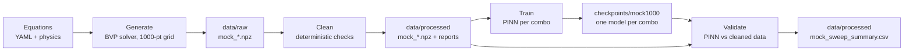

# Datasets & mock data

This page explains **what data exists in this project, where it lives, and
how it flows** from equations to trained models. If you only remember one
thing: **every dataset here is generated from the governing equations —
there are no external data files to download.**

## The big picture



Two dataset kinds exist:

| Kind | Source | Points | Purpose |
|---|---|---|---|
| **Baseline** (`baseline.npz`) | BVP solve of the flagship config | 400 (configurable) | Quick reference for `validate`/`plot` |
| **Mock grid** (`mock_*.npz`) | BVP solve per parameter combo | 1000 per combo | Reference truth for training + validation across the parameter space |

## Why mock data?

A PINN needs no labelled data to train (it learns from PDE residuals), but
you still need **reference truth** to know whether it learned correctly.
Instead of experiments, we solve the *same* equations with an independent
mesh-based solver (`solve_bvp`) on a dense grid. That gives 1000-point
reference profiles per parameter combination — the "mock data".

## File layout and naming

```text
data/raw/        mock_<params>.npz     # straight from the solver (immutable)
data/processed/  mock_<params>.npz     # cleaned copy used for validation
data/processed/  mock_<params>_cleaning_report.json
data/processed/  metrics_mock_<params>.json
data/processed/  mock_sweep_summary.csv
checkpoints/mock1000/mock_<params>/    # one trained model per combo
```

Names encode the combo, e.g. `mock_Fr0p2_Hs1p0_M1p0_Rd0p5` means
Fr=0.2, Hs=1.0, M=1.0, Rd=0.5 (`p` = decimal point, keys sorted).

Each `.npz` holds six arrays of equal length:

| Array | Meaning |
|---|---|
| `eta` | Similarity coordinate grid, strictly increasing |
| `f` | Velocity (stream function) |
| `fp` | Velocity gradient $f'$ (solver state, for QoIs) |
| `theta_f` / `theta_s` | Fluid / solid temperatures (LTNE pair) |
| `phi` | Concentration |

## Generation

`src/data/mock_data.py::generate_mock_data` solves the configured BVP on a
uniform 1000-point grid (`mock.n_points`). Optional seeded Gaussian `noise`
mimics measurement data (default `0.0` = clean reference). Generation is
deterministic given config + combo + seed.

Stiff corners (e.g. strong LTNE coupling at Hs=2.0) automatically retry once
with a relaxed mesh/tolerance — recorded as `solver_relaxed: true` in the
cleaning report, and carried into the summary CSV for transparency.

## Cleaning

`src/data/cleaning.py::clean_mock` applies deterministic, logged steps:

1. Drop rows with any non-finite value in required fields
2. Sort by η; dedupe η within tolerance
3. Optional physical clipping (`cleaning.clip`) and smoothing
   (`cleaning.smooth_window`, off by default)
4. Schema check: required keys present, lengths match, η strictly increasing

Every action is counted in `<stem>_cleaning_report.json`
(`n_in`, `n_out`, `n_dropped_nonfinite`, `n_deduped`, `n_clipped`,
warnings). Cleaning never touches `data/raw` — raw files are immutable,
clean copies land in `data/processed`.

## Consuming the data

| Consumer | Reads | Notes |
|---|---|---|
| `validate` / `plot` | `data/raw/baseline.npz` (or recompute) | Single-config reference |
| `mock` pipeline | `data/processed/mock_*.npz` | Per-combo reference truth |
| SHAP / LIME sweeps | Sweep tables (BVP QoIs, not stored) | See [Explainability](explainability.md) |

The PINN itself never trains on the mock fields — loss is purely PDE + BC
residuals. Mock data is the **answer key**, not the textbook.

## Reproducing everything

```bash
# Full pipeline for combos 14–21 (resumable slices; skips existing artefacts)
python main.py --config configs/mock_train_1000.yaml --mode mock --start 14 --end 21
# Regenerate everything from scratch (data + models)
python main.py --config configs/mock_train_1000.yaml --mode mock --force
```

Data-only regeneration (no training) is a few lines of Python:

```python
import yaml
from src.core.fluid_properties import compute_coefficients
from src.data.cleaning import clean_mock, save_clean_mock
from src.data.mock_data import (
    combo_name, generate_mock_data, override_physics, param_combos, save_mock,
)

cfg = yaml.safe_load(open("configs/mock_train_1000.yaml"))
for combo in param_combos(cfg["param_grid"]):
    cfg_c = override_physics(cfg, combo)
    raw = generate_mock_data(cfg_c, compute_coefficients(cfg_c), n_points=1000)
    stem = combo_name(combo)
    save_mock(raw, "data/raw", stem)
    clean, report = clean_mock(raw)
    save_clean_mock(clean, report, "data/processed", stem)
```

> **Note:** generated data and trained models are git-ignored by design
> (`data/raw/*.npz`, `data/processed/*.npz`, `checkpoints/`). The commands
> above recreate them anywhere. Only source, configs, docs and tests are
> committed.

## Current grid status

The default grid (`configs/mock_train_1000.yaml → param_grid`) is
M × Rd × Fr × Hs = 3 × 3 × 3 × 3 = **81 combos**:

- 81/81 BVP datasets converge and pass physicality checks (fields in
  [0, 1], monotone decay, visible LTNE splitting θs > θf downstream)
- Per-combo PINN training (5000 epochs) runs resumably via
  `--start/--end` slices; results accumulate in `mock_sweep_summary.csv`
  with per-field R² and a PASS/FAIL gate (mean R² ≥ 0.95)
